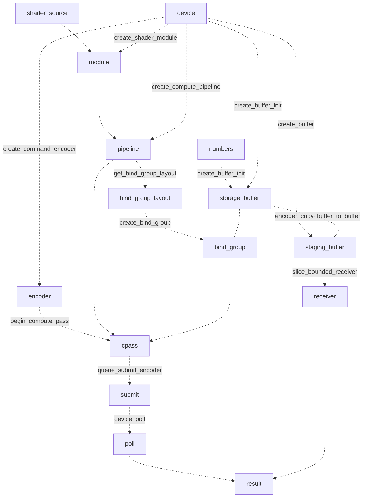

# 阅读 wgpu 代码记录

例子： [hello_compute](https://github.com/gfx-rs/wgpu/tree/trunk/examples/src/hello_compute)

## wgpu 基本流程
[hello_compiute](https://github.com/gfx-rs/wgpu/blob/trunk/examples/src/hello_compute/mod.rs)是一个使用 GPU 进行数学运算的示例，核心的代码位于：
- [Shader](https://github.com/gfx-rs/wgpu/blob/trunk/examples/src/hello_compute/shader.wgsl) 是运行于GPU上的代码。
- [execute_gpu_inner](https://github.com/gfx-rs/wgpu/blob/trunk/examples/src/hello_compute/mod.rs#L63) 是与GPU进行交互的代码
代码如下（进行了简化，详细的代码请参考 github hello_compute/mod.rs），

execute_gpu_inner 这个代码的结构还是有些复杂，我对其进行了整理，形成了一个数据流图，对照这个图来看，就比较好理解 webgpu 的各个错综复杂的实体之间的关系了。



-[ ] 思考：可以进一步的抽象，提供一个更加友好的 API，屏蔽 wgpu 的内部细节。

## 各个操作的耗时
| 操作                    | 耗时（us） | 占比 |
|-------------------------|:---------|------|
| poll                    | 1330     | 45%  |
| create_compute_pipeline | 756      | 26%  |
| create_shader_module    | 209      | 7.2% |
| copy_buffer_to_buffer   | 120      | 4.1% |
| submit                  | 98       | 3.3% |
| create_buffer_init      | 67       | 2.3% |

如果说 poll 的时间是GPU 实际计算的开销，那么可以看到准备数据的时间耗时接近 1.5ms 了。这也是和CPU 对比时，可能会性能对比并不大的原因了

## 与 CPU 版本的性能对比
基于 hello_compute, 我编写了一个对比的 cpu 版本：

```rust 

fn time<T, F>( label: &str, op: F)  -> T where F: FnOnce() -> T  {
    let tm0 = std::time::Instant::now();
    let result = op();
    let tm1 = std::time::Instant::now();
    println!("{} in {:?}", label, tm1.duration_since(tm0));
    result
}

fn run_test() {
    // read numbers from args
    let numbers = std::env::args()
        .skip(2)
        .map(|s| u32::from_str(&s).expect(
            &format!("You must pass a list of positive integers {s}!") ))
        .collect::<Vec<u32>>();
    let result = time("running_cpu", || numbers.iter().map(|&n| test2(n)).collect::<Vec<u32>>() );
    println!("running_cpu Steps {:?}", result);
}

fn test2(n_base: u32) -> u32 {
    let mut n: u32 = n_base;
    let mut i: u32 = 0;
    loop {
        if n <= 1 {
            break;
        }
        if n % 2 == 0 {
            n = n / 2;
        }
        else {
            // Overflow? (i.e. 3*n + 1 > 0xffffffffu?)
            if n >= 1431655765u32 {   // 0x55555555u
                return 4294967295u32;   // 0xffffffffu
            }

            n = 3 * n + 1;
        }
        i = i + 1;
    }
    return i;
}
```

分别进行了如下的测试 N 从 1K - 60K 的测试。


从这个的图可以看出：对比与CPU版本，在20K 规模之前，CPU 版本耗时更少，单随着 N 的增加，CPU 耗时基本上线性增加，而 GPU 版本从从 1K - 60K，基本维持不变（受限与目前的代码，GPU 版本，单次提交最多64K 数据。）

那么，当数据量持续增加，且复用 GPU 的如下资源：
- module
- staging_buffer/storage_buffer
- pipeline

在这种情况下，GPU 的提速效果会更为明显。

## GPU 与 数据分析思考

目前，OLAP 分析的提速主要有如下的技术手段：
- 列式存储： 列式存储对于宽表的 OLAP 计算在 IO 上有显著的优势，因为大部份的查询仅使用宽表的部分字段。
- 列式计算： 在内存中使用 vector 模式存储列信息，并基于列计算的方式替代行计算，从而充分利用 CPU 的 cache命中。参见  [MonetDB/X100: Hyper-Pipelining Query Execution](http://cidrdb.org/cidr2005/papers/P19.pdf) by Peter Boncz, Marcin Zukowski and Niels Nes.
- SIMD: 基于向量的计算模式，可以充分利用 SIMD 加速能力。C/C++/Rust等语言均有编译器级别SIMD优化，也有SIMD的库，显示的使用 SIMD 的能力。

目前来看，使用 GPU 进行加速，目前还不是主流，但应该是一个不错的发展方向，对比 SIMD，基于GPU 计算会有如下的优势：
- WebGPU 标准已趋于成熟，Chrome/Firefox等浏览器已支持 webgpu。在 Rust 生态中，wgpu 项目已经可以支持 WGSL 并且运行在 Windwos(Vulkan/DX12)、Linux(Vulkan)、Mac(Metal)、WEB(webgpu）上，相当于已经有了一个跨平台的底层开发支持。
- SIMD 的并发限制较大，向量宽度一般在 128b - 512b 之间，相当于4-16个整数。而 GPU 的上限要高很多，譬如 RTX 4090 有多达 16384 个计算单元（对应 AVX 512 为 16，提升了 1024倍）
- SIMD 并不能适应 分支计算，而 GPU 上可以支持分支计算。类似于 case when 的计算，更适合在 GPU上完成。
